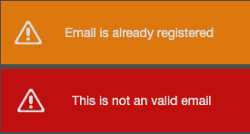
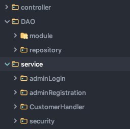

#Customer Management Page. 

This is my second pet project, which is still under developing. 
I created a customer management page, where you can keep all of your customer's data orderly. 
You can add, delete and search customers by name.

#Technology stack: 
- Java8
- Spring Boot
- JPA
- PostgresSQL
- Docker
- Angular 7

#Docker hub             
You also can find this project on docker hub.                   
If you have docker on your machine you can pull it. 
CLI.
1) $ docker pull danielszakacs/customer_management:tagname
2) $ docker run -p 8080:8080 danielszakacs/customer_management:tagname
3) check http://localhost:8080             

#Outlook:
To see the project on Heroku, please use this link: https://customermanagerpage.herokuapp.com/
                       
Exception massage:                  
                    

#Set-up:                       

