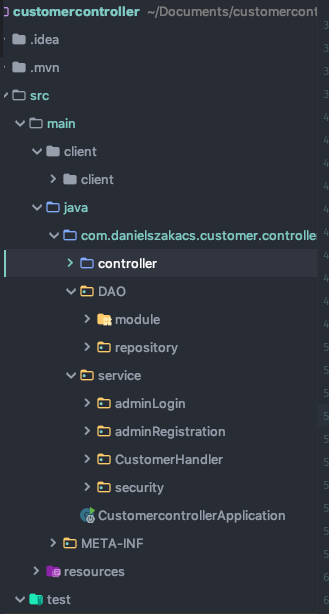
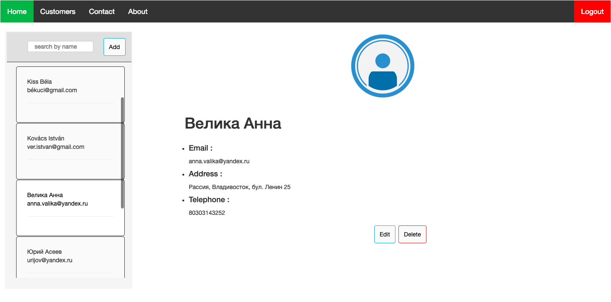

#Customer Management Page. 

This is my second pet project, which is still under developing. 
I created a customer management page, where you can keep all of your customer's data orderly. 
You can add, delete and search customers by name.

#Technology stack: 
- Java8
- Spring Boot
- JPA
- PostgresSQL
- Docker
- Angular 7

#Set-up: 

#Outlook:
To see the project on Heroku, please use this link: https://customermanagerpage.herokuapp.com/

